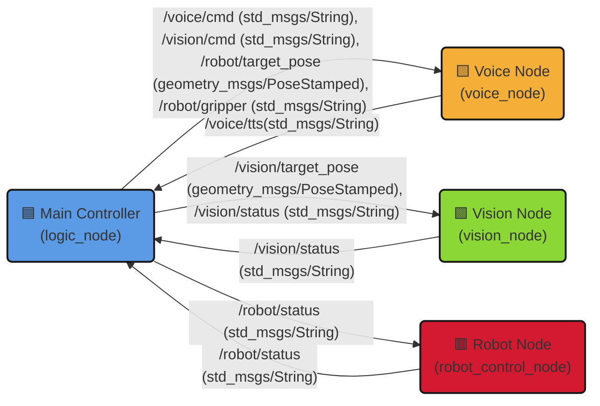

# 🤖 FiXit: AI-Powered PCB Repair Assistant Robot
"The Smart Third Hand for Engineers" > LLM(GPT-4o) 기반의 음성 인식과 **Vision AI(YOLO+MediaPipe)**를 결합한 지능형 PCB 수리 보조 로봇 프로젝트입니다.

[](https://docs.ros.org/en/humble/)
[](https://www.python.org/)
[](https://www.doosanrobotics.com/)
[](https://openai.com/)

## 📖 프로젝트 소개 (Overview)
**Fixit**은 양손을 모두 사용하여 정밀한 PCB 수리 작업을 수행하는 엔지니어를 위한 **협동 로봇(Cobot) 솔루션**입니다.
단순한 반복 작업이 아니라, **GPT-4o 기반의 자연어 이해**와 **Vision AI 기반의 의도 파악**을 통해 작업자와 실시간으로 소통하며 도구를 전달하거나 부품을 잡아줍니다.

### 🌟 Key Features
🗣️ Natural Language Control (GPT-4o)

단순 키워드가 아닌 자연어 맥락을 이해합니다.

"납이 잘 안 녹네" → **Flux(플럭스)**를 가져다줌.

"여기 좀 잡아줘" → 손짓을 인식하여 해당 위치 파지.

👆 Hand Tracking & Pointing

작업자가 손가락으로 가리키는 위치를 3차원 좌표로 변환하여 정밀하게 접근합니다.

Robust Depth Filtering을 적용하여 손떨림이나 노이즈에 강인합니다.

🛡️ Human-in-the-Loop Safety

물체를 잡기 전 **"잡아(Catch)"**라는 음성 트리거가 있어야만 그리퍼가 닫힙니다.

작업자의 손 끼임 사고를 원천 차단합니다.

🚑 Auto Error Recovery

충돌 감지 시 자동으로 서보를 차단하고, "복구" 명령 시 스스로 초기 상태로 리셋합니다.

---

## ⚙️ 시스템 아키텍처 (System Architecture)

전체 시스템은 **ROS 2 (Robot Operating System)** 위에서 4개의 핵심 노드가 유기적으로 통신하며 동작합니다.


### Hardware Setup

| Component | Model              | Description                             |
|-----------|--------------------|-----------------------------------------|
| Robot Arm | Doosan M0609        | 6축 협동 로봇 (Payload 6kg)             |
| Gripper   | OnRobot RG2         | 2-Finger 그리퍼 (Modbus TCP 제어)      |
| Camera    | Intel RealSense D435| Depth & RGB Vision                      |
| Microphone| USB Condenser Mic   | 음성 수음                               |
| Speaker   | USB Speaker         | TTS 음성 출력                           |

---

## 🚀 Installation & Setup

### 1. Prerequisites
OS: Ubuntu 22.04 LTS

ROS2: Humble Hawksbill

Python: 3.10+

Doosan Robotics Packages: dsr_msgs2, dsr_control2

### 2. Clone Repository

```bash
mkdir -p ~/FiXit_ws/src
cd ~/FiXit_ws/src
git clone https://github.com/flashbulb20/FiXit_ws.git
```

### 3. Install Dependencies
```bash
cd ~/FiXit_ws
pip install openai ultralytics mediapipe pymodbus pygame
```

### 4. Build Workspace
```bash
colcon build --symlink-install
source install/setup.bash
```
### 5. Environment Config
OpenAI API Key 설정을 위해 .env 파일을 생성합니다.
```bash
# src/fixi_project/.env
OPENAI_API_KEY=sk-proj-xxxxxxxxxxxxxxxxxxxxxxxx
```

---

## 💻 Usage
4개의 터미널을 열어 각 노드를 실행합니다.

### 1. Robot Controller (Hardware Interface)
로봇 팔과 그리퍼를 제어하며, 에러 복구 서비스를 담당합니다.
```bash
ros2 run fixi_project fixi_robot
```
### 2. Vision Node (Eye)
객체 인식(YOLO) 및 손 추적(MediaPipe)을 수행합니다.
```bash
ros2 run fixi_project fixi_vision
```
### 3. Voice Node (Ear & Mouth)
사용자의 음성을 듣고 의도를 파악하여 명령어로 변환합니다.
```bash
ros2 run fixi_project fixi_voice
```
### 4. Main Controller (Brain)
전체 시나리오를 조율하고 시퀀스를 실행합니다.
```bash
ros2 run fixi_project fixi_main
```

---

## 🗣️ Voice Commands Guide
사용자는 자연어로 명령할 수 있습니다. 로봇은 GPT-4o를 통해 의도를 파악합니다.

| 시나리오        | 사용자 발화 예시                         | 로봇 동작                                             |
|-----------------|------------------------------------------|------------------------------------------------------|
| 도구 가져오기   | "납흡입기 가져와", "플럭스 좀 줘"         | 해당 도구를 찾아 집어서 작업자에게 전달             |
| PCB 파지        | "이 기판 좀 잡아줘"                       | 교환 위치로 이동하여 그리퍼 벌리고 대기              |
| 포인팅 파지     | "여기 잡아줘" (손짓)                     | 손가락이 가리킨 허공 위치로 이동하여 대기            |
| 안전 트리거     | "잡아!", "캐치"                          | (대기 상태일 때) 그리퍼를 닫음                       |
| 확대/검사      | "여기 확대해봐", "돋보기로 봐"            | 돋보기를 들고 손이 가리킨 곳을 확대                  |
| 미세 조정       | "조금만 위로", "오른쪽으로"              | TCP 기준 미세 이동 (Nudge)                           |
| 에러 복구       | "복구해", "충돌 해결해"                  | 서보 리셋 및 안전 위치 복귀                          |

---

## ⚠️ Troubleshooting & Safety
### 🚨 Collision Detected (충돌 발생 시)
로봇이 어딘가에 부딪혀 멈췄다면 당황하지 말고 아래 순서를 따르세요.

로봇이 빨간불(Error) 상태인지 확인합니다.

음성으로 "복구해줘" 또는 **"원상 복구"**라고 말합니다.

로봇이 자동으로 Servo Off -> Error Reset -> Servo On 과정을 수행합니다.

### 🔍 Vision Not Detecting (인식 불가 시)
조명 확인: 작업대가 너무 어둡거나 그림자가 지지 않았는지 확인하세요.

거리 확인: 카메라는 최소 20cm 이상의 거리가 필요합니다.

명령 확인: Vision Node 터미널에서 [CMD] 명령 수신 로그가 뜨는지 확인하세요.

---

## 👥 Contributors
Project Lead & System Arch: Flashbulb20

Vision System: [Team Member Name]

Voice AI & LLM: [Team Member Name]

Robot Control: [Team Member Name]

---

## 📄 License